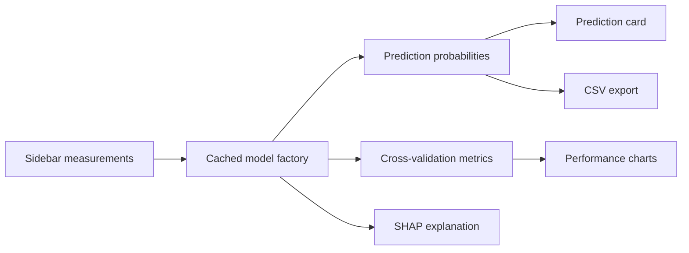

# Iris Flower Species Classifier

[](https://karma0san-iris-detection.streamlit.app/)
[](https://github.com/sandeepkarmacharya/iris_detection/actions/workflows/ci.yml)
[](https://hub.docker.com)
[](https://python.org)
[](https://scikit-learn.org)
[](LICENSE)

An interactive **Iris flower species classifier** built with Streamlit, scikit-learn, XGBoost, and SHAP. The app predicts Iris species from sepal and petal measurements, compares several classifiers, explains predictions, and includes tests, Docker support, and GitHub Actions CI.

> **Note:** This repository is an Iris flower classifier, not an eye/biometric iris detection app. The repo name is historical; the project uses Fisher's Iris flower dataset.

---

## Why This Project Exists

This project demonstrates how a small machine-learning classifier can be presented as a reproducible, portfolio-ready application. The focus is not just model accuracy on a classic dataset, but also software engineering practices around testing, explainability, deployment, and clean user experience.

---

## Live Demo

Try the deployed app on Streamlit Community Cloud:

**[karma0san-iris-detection.streamlit.app](https://karma0san-iris-detection.streamlit.app/)**

---

## Features

- **Instant predictions:** Adjust sepal/petal measurements and see predicted species plus confidence.
- **Multiple classifiers:** Random Forest, SVM, Logistic Regression, and XGBoost.
- **Model comparison:** Compare all classifiers side by side for the same input.
- **Model explainability:** SHAP waterfall plots show feature contributions for the predicted class.
- **Model performance:** Cross-validation accuracy, confusion matrix, and per-class metrics.
- **Visual exploration:** Scatter plots, PCA projection, feature distributions, and decision boundaries.
- **Hyperparameter tuning:** Interactive controls for each model with tuned-vs-default CV comparison.
- **CSV export:** Download prediction results for documentation or reporting.
- **Reproducibility:** Docker, docker-compose, automated tests, and CI across Python 3.10-3.12.

---

## How It Works

1. The sidebar collects four numerical measurements: sepal length, sepal width, petal length, and petal width.
2. A cached model factory trains or retrieves the selected classifier.
3. The app returns the predicted class, class probabilities, and optional SHAP explanation.
4. Additional tabs show dataset visualizations, model metrics, and hyperparameter tuning results.

---

## Architecture



The Streamlit UI is intentionally simple, while reusable helper functions handle model construction, comparison metrics, tuning models, and SHAP value selection. This keeps critical logic testable without relying only on manual UI checks.

---

## Local Setup

```bash
# 1. Clone the repo
git clone https://github.com/sandeepkarmacharya/iris_detection.git
cd iris_detection

# 2. Create and activate a virtual environment
python -m venv .venv
source .venv/bin/activate

# 3. Install dependencies
pip install -r requirements.txt

# 4. Run the app
streamlit run iris_detection.py
```

Open [http://localhost:8501](http://localhost:8501) in your browser.

---

## Docker

### Build and run with Docker

```bash
docker build -t iris-classifier .
docker run -d -p 8501:8501 --name iris-classifier iris-classifier
```

### Or use docker-compose

```bash
docker compose up -d
```

Open [http://localhost:8501](http://localhost:8501) in your browser.

---

## Project Structure

```text
iris_detection/
├── iris_detection.py       # Streamlit application and testable helper functions
├── requirements.txt        # Python dependencies
├── Dockerfile              # Container image definition
├── docker-compose.yml      # Docker Compose configuration
├── .dockerignore           # Files excluded from Docker builds
├── tests/
│   └── test_app.py         # Unit and regression tests
├── .github/
│   └── workflows/
│       └── ci.yml          # GitHub Actions CI pipeline
├── .devcontainer/
│   └── devcontainer.json   # VS Code / GitHub Codespaces config
├── LICENSE                 # MIT license
└── README.md               # Project documentation
```

---

## Testing and Quality Checks

```bash
python -m pytest tests/ -q
ruff check .
```

The test suite covers dataset assumptions, model training, prediction probabilities, decision-boundary models, feature importance, tuning helpers, model comparison metrics, and SHAP multiclass selection.

---

## About the Dataset

The [Iris flower dataset](https://en.wikipedia.org/wiki/Iris_flower_data_set), also known as Fisher's Iris dataset, contains:

- **150 samples:** 50 from each of three Iris species.
- **4 features:** sepal length, sepal width, petal length, and petal width.
- **3 classes:** Iris setosa, Iris versicolor, and Iris virginica.

Introduced by Ronald Fisher in 1936, it is one of the most common introductory datasets for classification and pattern recognition.

---

## Limitations

- The dataset is small and built into scikit-learn, so this project is best understood as an ML engineering demo rather than a production classifier.
- The app classifies Iris flower measurements; it does not classify flowers from images.
- Model explainability is included for educational value, but SHAP results on a small tabular dataset should be interpreted as illustrative rather than definitive.
- The app is not intended for botanical field use or scientific measurement validation.

---

## Tech Stack

| Technology | Purpose |
|---|---|
| [Streamlit](https://streamlit.io) | Interactive web app framework |
| [scikit-learn](https://scikit-learn.org) | Dataset, classifiers, metrics, and cross-validation |
| [XGBoost](https://xgboost.readthedocs.io) | Gradient boosted tree classifier |
| [SHAP](https://shap.readthedocs.io) | Model explainability |
| [Matplotlib](https://matplotlib.org) | Charts and plots |
| [Seaborn](https://seaborn.pydata.org) | Statistical visualization styling |
| [pandas](https://pandas.pydata.org) | Data handling |
| [Docker](https://docker.com) | Containerized deployment |

---

## License

This project is licensed under the **MIT License**. See [LICENSE](LICENSE) for details.
